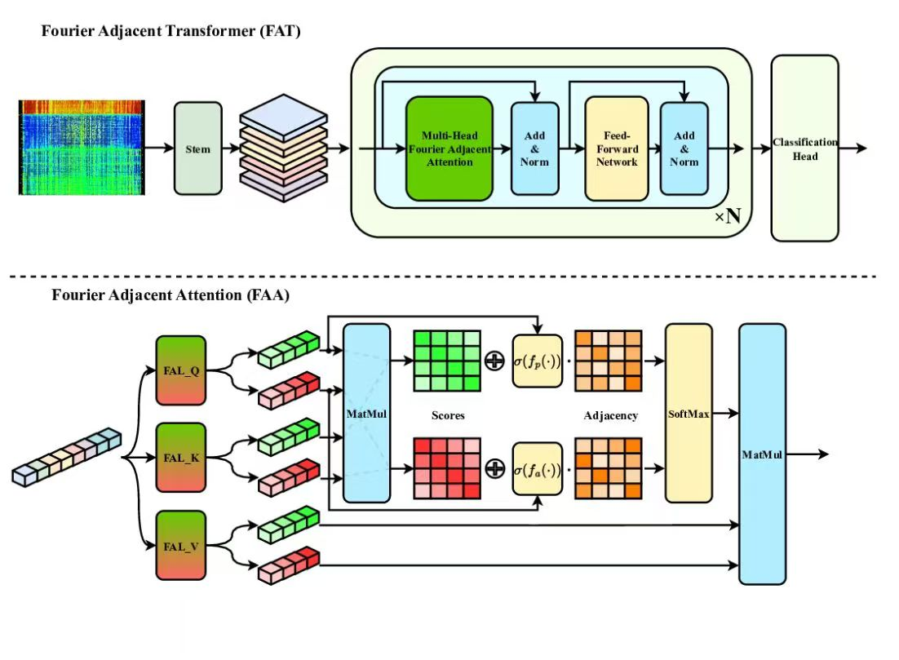

# FAT 🧠 Fourier Adjacency Transformer for EEG Emotion Recognition

This is the **official implementation** of the paper:

> **A Novel Fourier Adjacency Transformer for Advanced EEG Emotion Recognition**

📄 **Paper:** [Click here to read the paper](https://arxiv.org/pdf/2503.13465)

> **Abstract**
> EEG emotion recognition faces significant hurdles due to
 noise interference, signal nonstationarity, and the inherent complexity of
 brain activity which make accurately emotion classification. In this study,
 we present the Fourier Adjacency Transformer, a novel framework that
 seamlessly integrates Fourier-based periodic analysis with graph-driven
 structural modeling. Our method first leverages novel Fourier-inspired
 modules to extract periodic features from embedded EEG signals, effec
tively decoupling them from aperiodic components. Subsequently, we em
ploy an adjacency attention scheme to reinforce universal inter-channel
 correlation patterns, coupling these patterns with their sample-based
 counterparts. Empirical evaluations on SEED and DEAP datasets demon
strate that our method surpasses existing state-of-the-art techniques,
 achieving an improvement of approximately 6.5% in recognition accu
racy. By unifying periodicity and structural insights, this framework of
fers a promising direction for future research in EEG emotion analysis.
> 

  

<b>Figure:</b> Overview of the FAT model architecture.

# Requirements:
- Python 3.10
- PyTorch 2.2.2
- CUDA 11.8+ (if using GPU)

# Datasets:
Please refer to the methodological division in the paper
- [SEED](https://bcmi.sjtu.edu.cn/~seed/)  
  > A multi-subject emotion recognition dataset with 3-class labels (positive, neutral, negative) recorded via 62-channel EEG.
- [SEED-IV](https://bcmi.sjtu.edu.cn/~seed/seed-iv.html)  
  > A 4-class version of SEED, using similar experimental settings but with an expanded emotion label set.
- [SEED-V](https://bcmi.sjtu.edu.cn/~seed/seed-v.html)
  > A 5-class EEG emotion dataset with higher emotional resolution. Includes: joy, sadness, anger, fear, neutral.
- [SEED-VII](https://bcmi.sjtu.edu.cn/~seed/seed-vii.html)
  > A 7-class dataset for fine-grained emotion recognition using 62-channel EEG across multiple sessions.
- [DEAP](https://www.eecs.qmul.ac.uk/mmv/datasets/deap/)   
  > Dataset for emotion analysis using EEG and peripheral physiological signals (32 channels), includes video-based stimuli.
